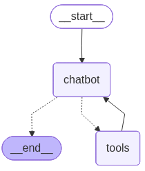
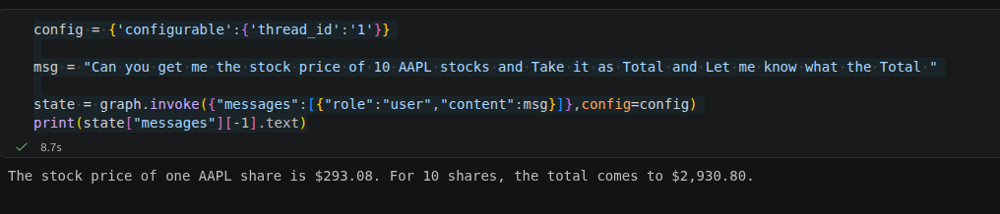
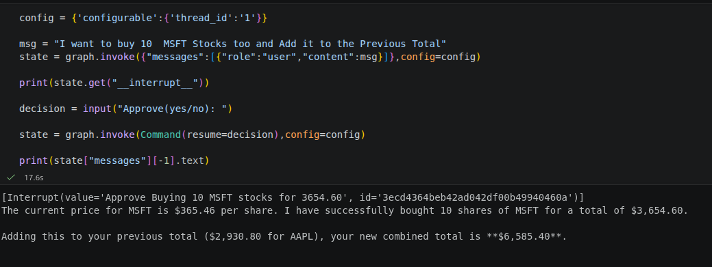

# LangGraph Agent

Build a Research Assistant that:

1. Remembers past messages (Memory)
2. Pauses and asks for approval before performing important actions (Human in the Loop)

## LangGraph Graph

## Commands Screenshots

### Command 1

### Command 2

