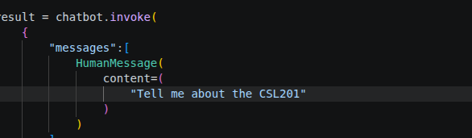
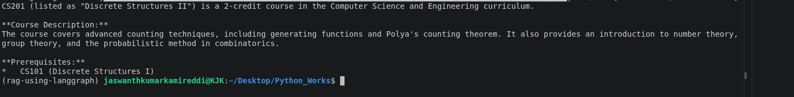

# RAG Using Langgraph

Used cos (Course of Study PDF)

```bash
Prompt:
Tell me about the DSAI Course Subjects

Output:
The Data Science and Artificial Intelligence (DSAI) curriculum is structured to provide a strong foundation in core sciences, mathematics, and specialized computing topics. Based on the provided documentation, here is a summary of the subjects across the first five semesters:

### Semester I
*   **Core Technical:** Introduction to Programming, Digital Fabrication, Electromagnetism, Materials Chemistry I
*   **Mathematics:** Linear Algebra I, Probability and Statistics
*   **Other:** Chemistry/Physics Lab, Professional Communication Lab I (Sketching and Drawing), Creative and Liberal Arts courses, Essential Physical Activity

### Semester II
*   **Core Technical:** Applied Digital Logic Design, Data Structures
*   **Mathematics/Theory:** Linear Algebra II, Calculus I, Mathematical Foundations for Data Science, Discrete Structures I
*   **Science/Other:** Quantum Physics, Physics/Chemistry Lab, Professional Communication Lab II (Presentation Skills)

### Semester IV
*   **Core DS/AI:** Architecture for Management of Large Datasets, Statistical Programming, Artificial Intelligence, Big Data Lab
*   **Other:** Materials Chemistry II, Basics of Bioinformatics, Professional Ethics, Creative and Liberal Arts courses

### Semester V
*   **Core DS/AI:** Information Security, Machine Learning, Artificial Intelligence and Machine Learning Lab
*   **Other:** Materials Chemistry III, Departmental Electives, CALA Courses

***

*Note: In addition to the academic coursework, students are also required to participate in activities such as the National Service Scheme (NSS) or the National Sports Organization (NSO).*
```


## Screenshots





---
